# D触发器（寄存器学习）

# 1、原理 
 在之前学习得二选一多路器与38译码器是属于组合电路逻辑，
 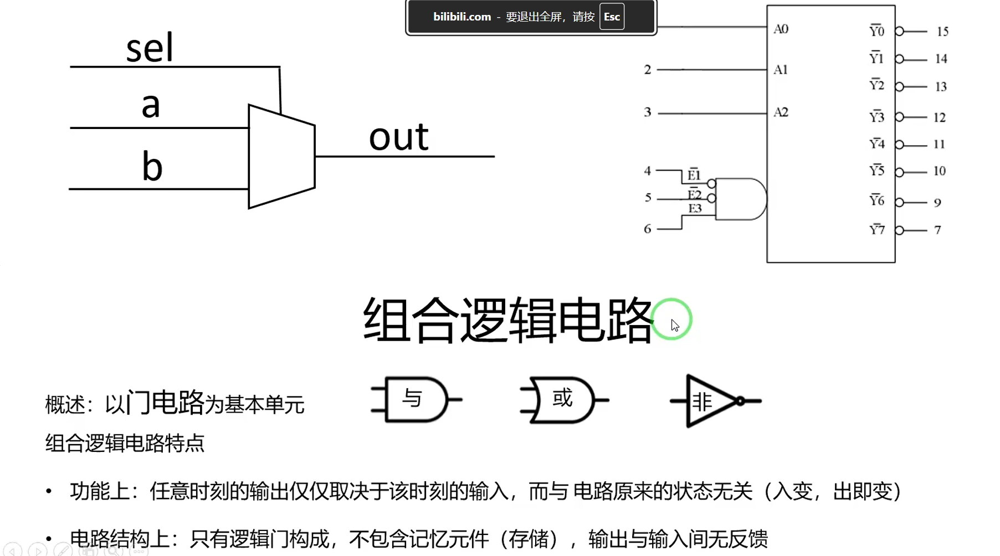

 而现在学习的D触发器属于时序逻辑  具有储存得功能
 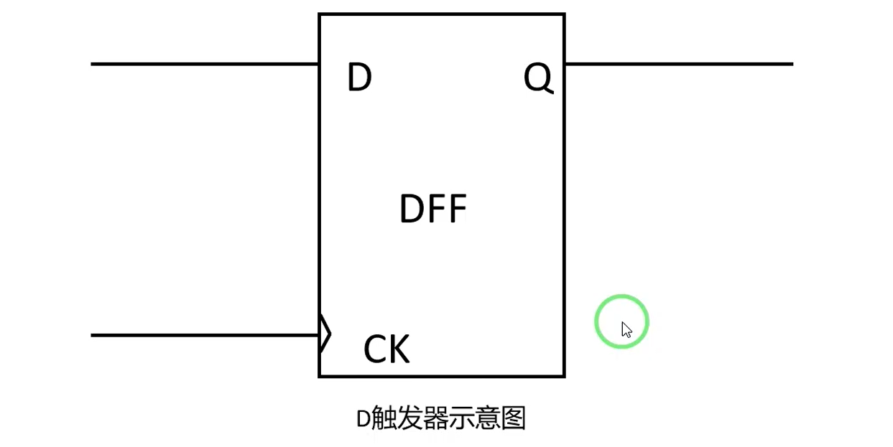
 D端口为输入端口，Q端口为输出端口，CK端口为时钟端口  
 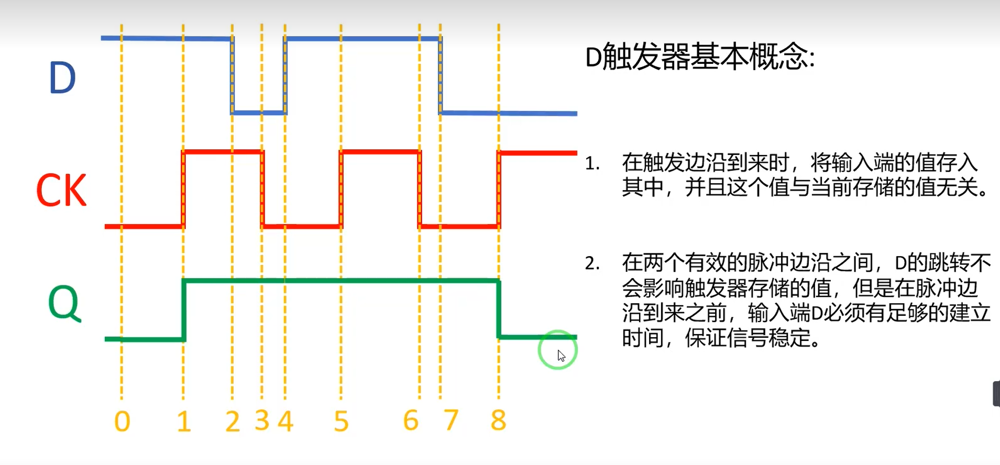
 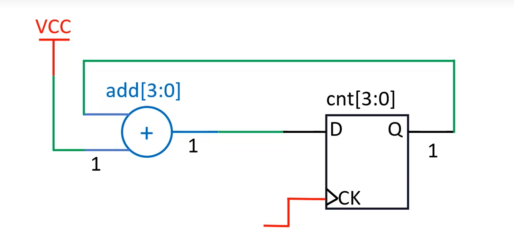

 # 2、Verilog 实现 LED灯按频率闪烁  
 Reset_n ：低电平有效的复位
 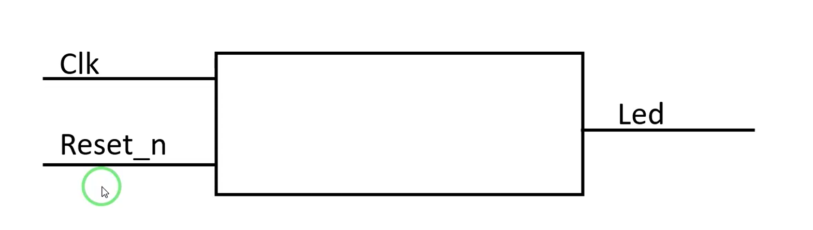
 新建项目文件
 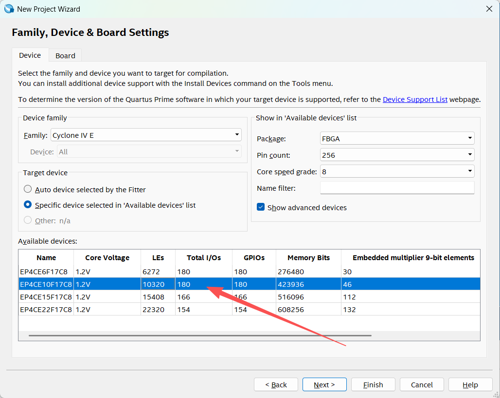
 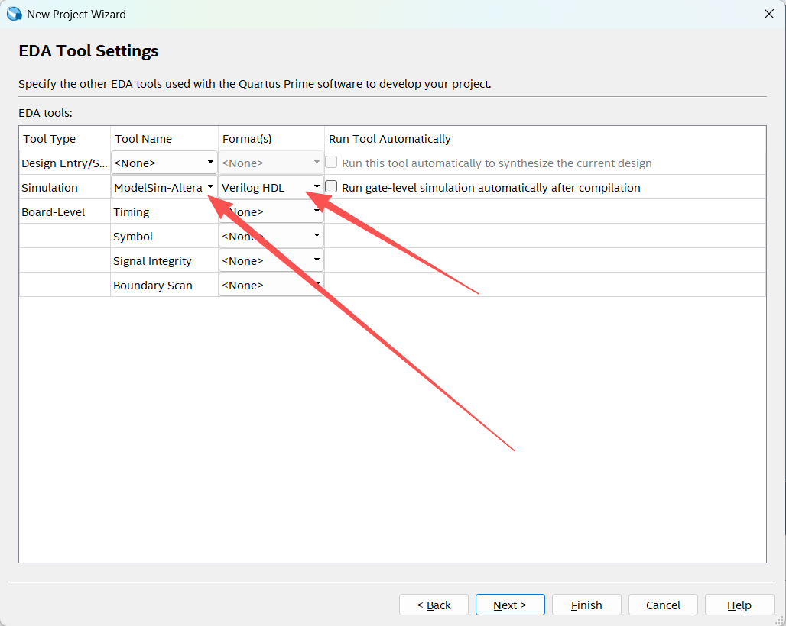
 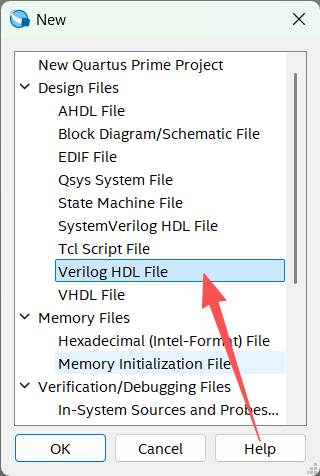
 开始代码编写
 频率解释
 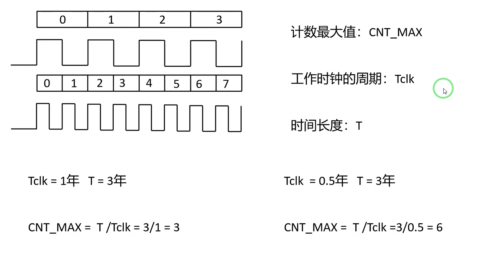
 换算：
 已知晶振为50MHz 那一个周期的时长为
  1000 000 000 / 50 000 000 = 20 ns(纳秒)

 那现在需要计时500ms的周期是多少个呢？
 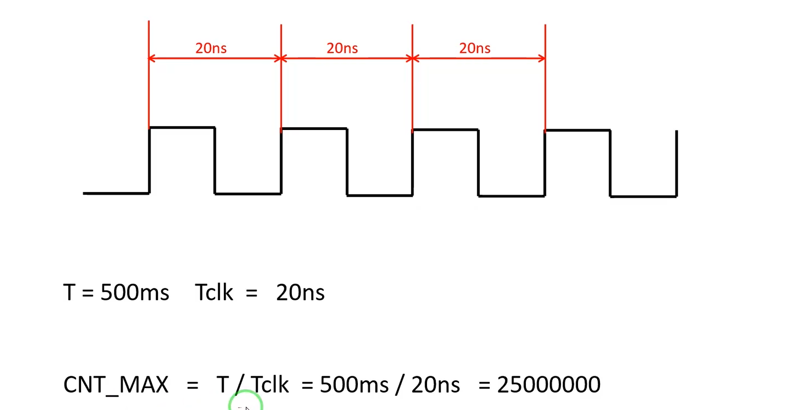
 500 000 000 /20 = 25 000 000 
 计算位宽 -- 25位
 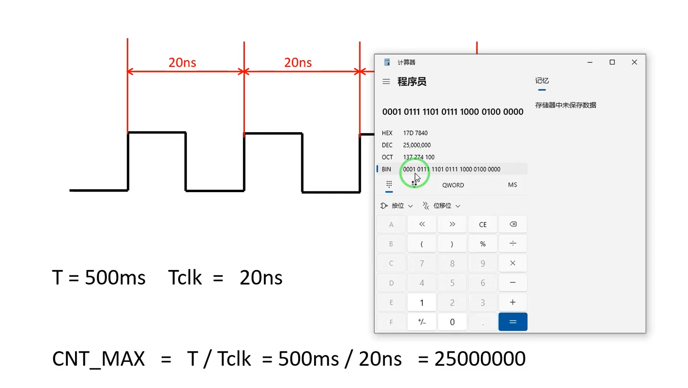
这是我写的代码，能找出里面有多少错误的地方吗？
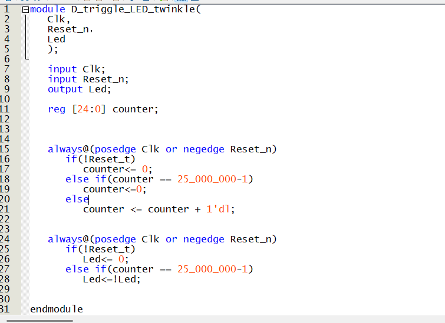
是的，短短几句代码，就有如此多的错误
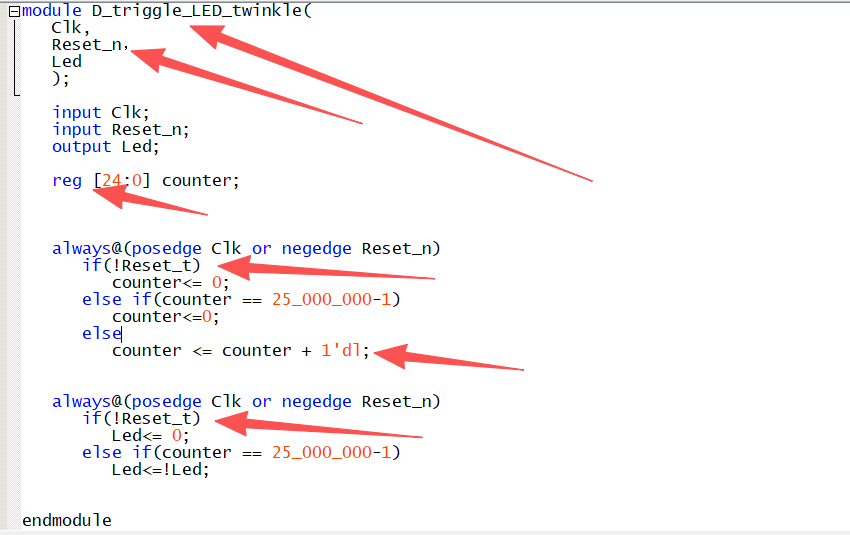
这是纠正过得
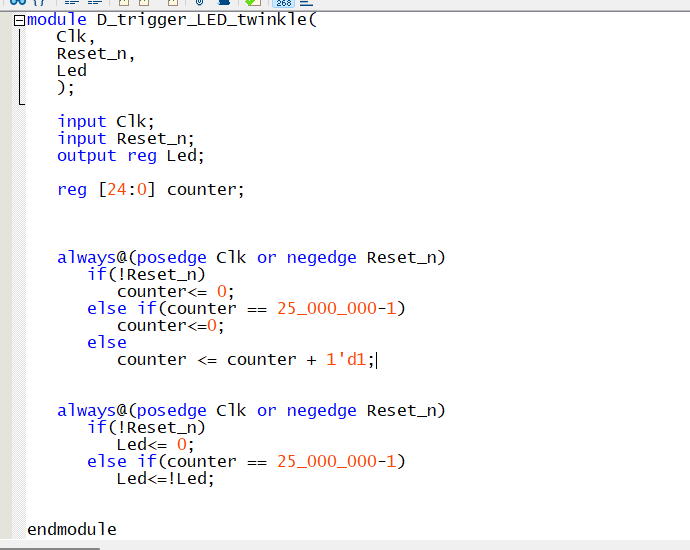

# 打开逻辑图纸看一下
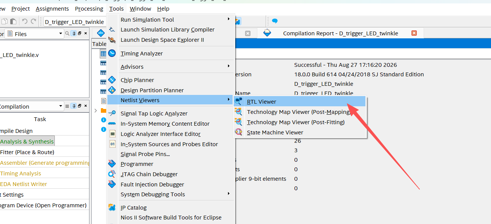
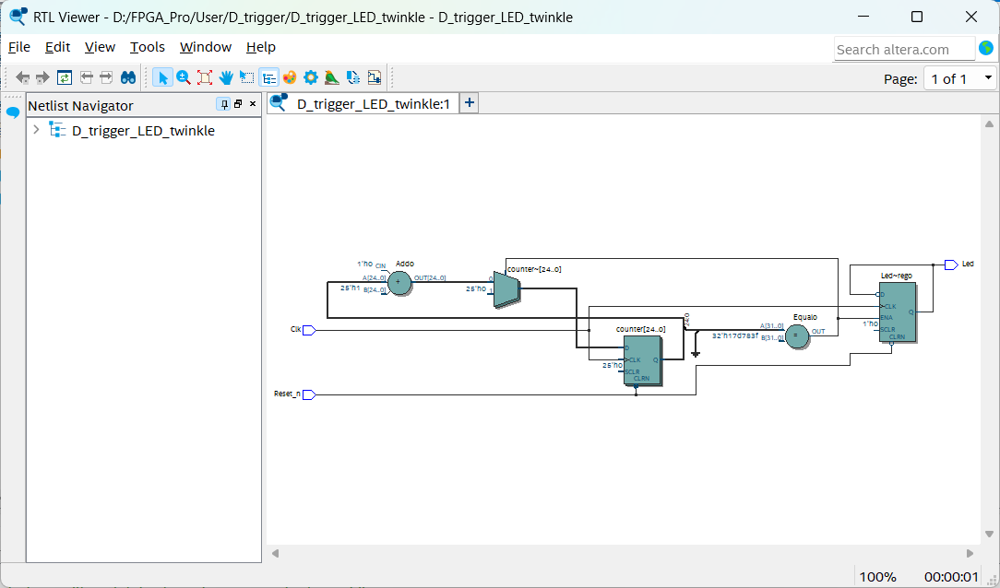

# 3、仿真文件的编写，  *.tb
这里注意去反和取非得关系   ~ 和 ！的关系  ，对于单比特数据来说，他们没有区别，但是对于多比特来说相差甚远，至于原因，忘了的话建议自己查一下
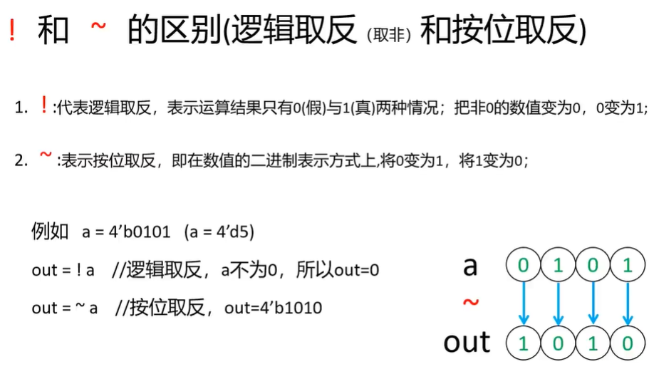
仿真结果  这里可以使用光标来查看具体的时间单位
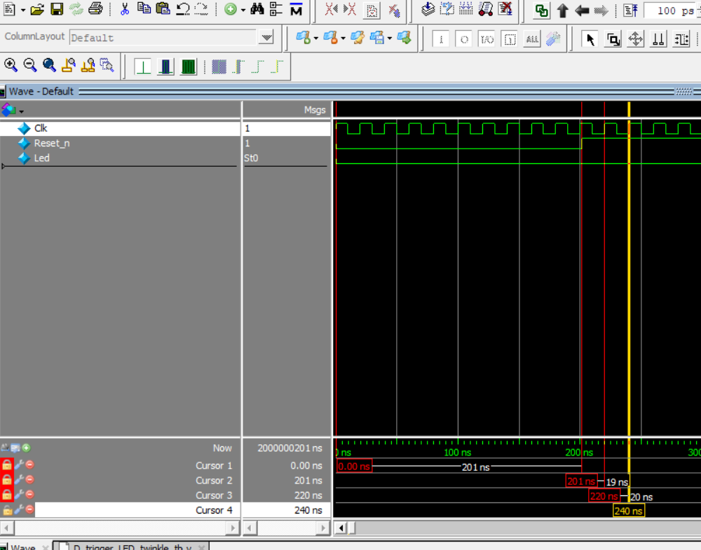
设置时间单位 对着底下的20ns 右键菜单
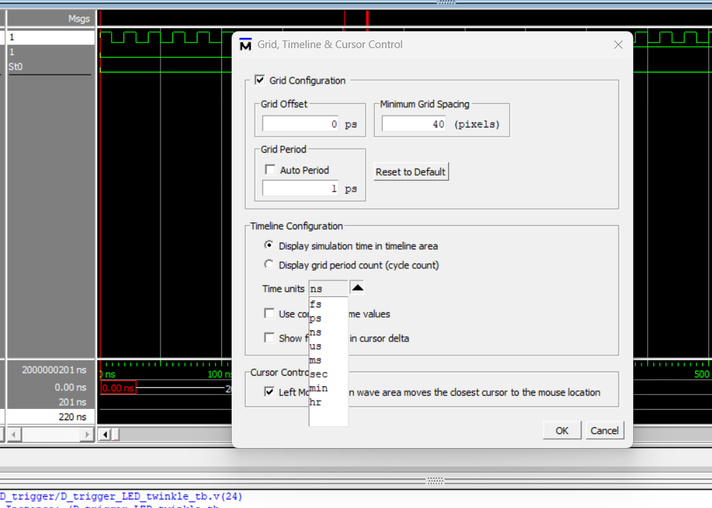

结果
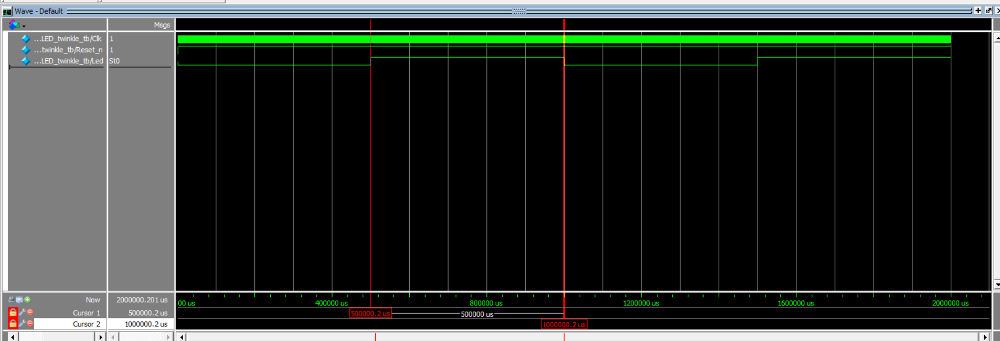

# 4、板载测试
