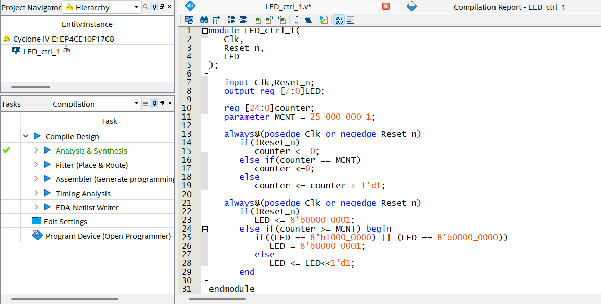
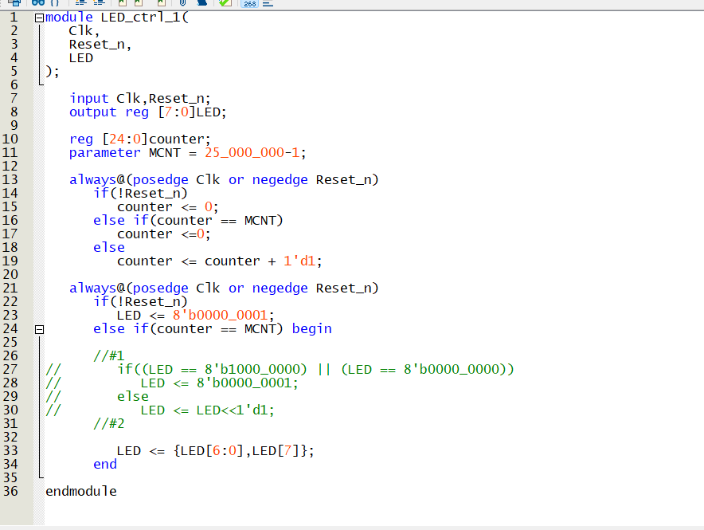
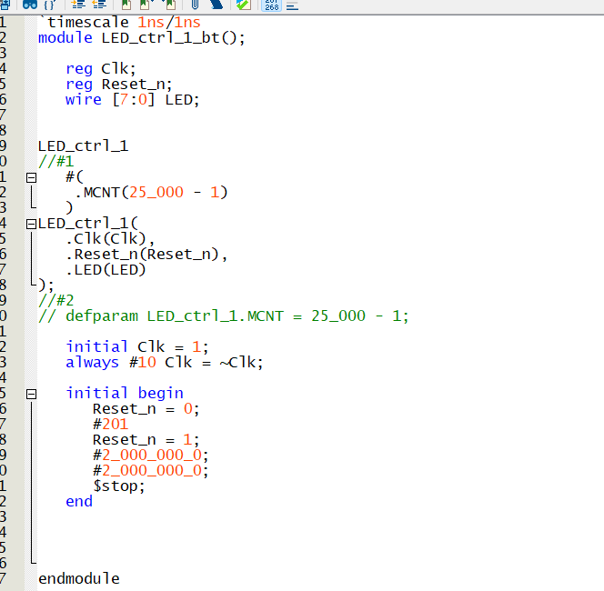
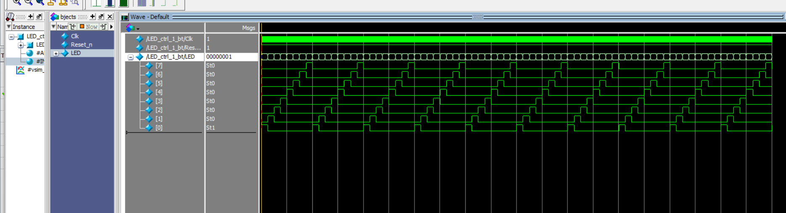
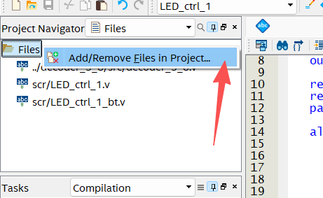
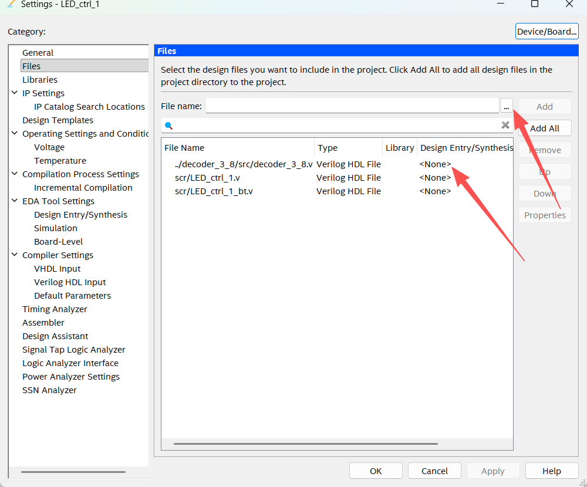
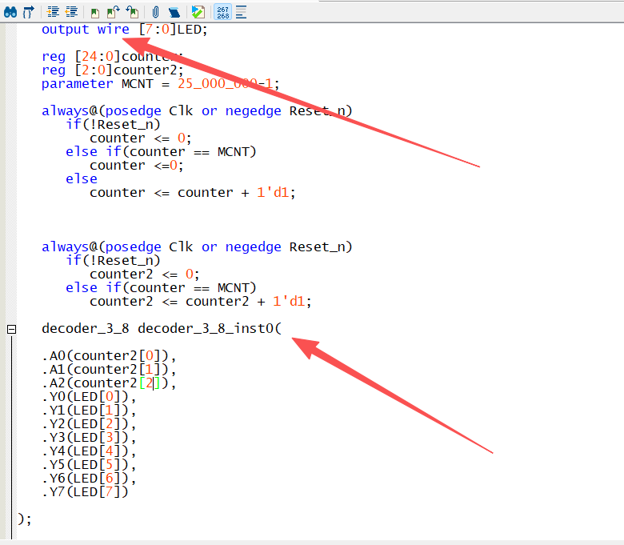
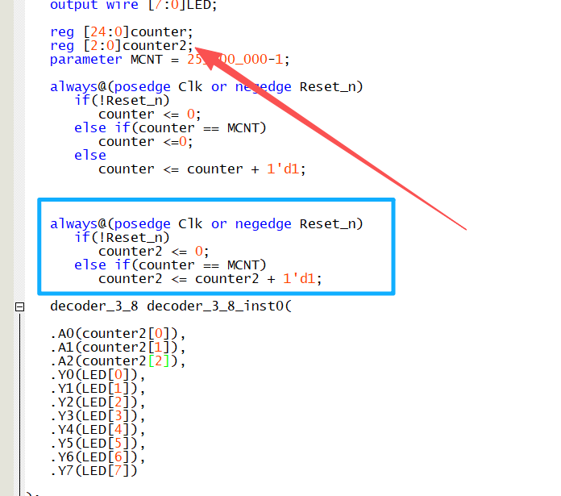
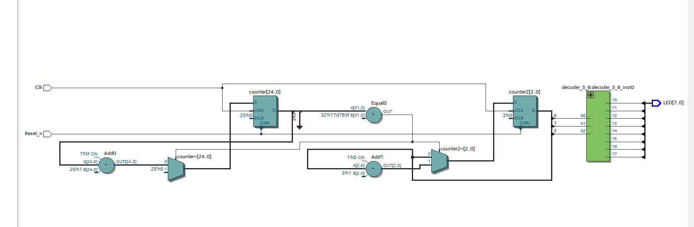
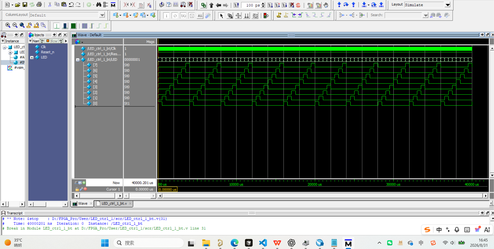

# LED 跑马灯

# 1、程序编写

# 2、testbentch 编写    这里使用了两种方式并且使用了  parameter  和  defparam  的使用方法 和两种改MCNT的方式

# 3、验证仿真

# 4、在原文件中添加其他已写好的模块进行混合调用  使用38译码器  重在 在设计中如何调用我们已经设计好的源码模块，

在这里添加，我已经添加过了

这里使用时直接使用例化，然后reg的改成wire，具体原因可以自行去找

这里我们新加了counter2来作为38的输入脚
3位刚好有8种输出，后面7+1为0又循环所以不用做其他限制

# 5、编译成功 原理图生成

# 6、仿真结果 和之前的仿真结果一样
