# 38译码器的学习过程

# 1、新建工程 熟悉的新建一个工程（不看例程）
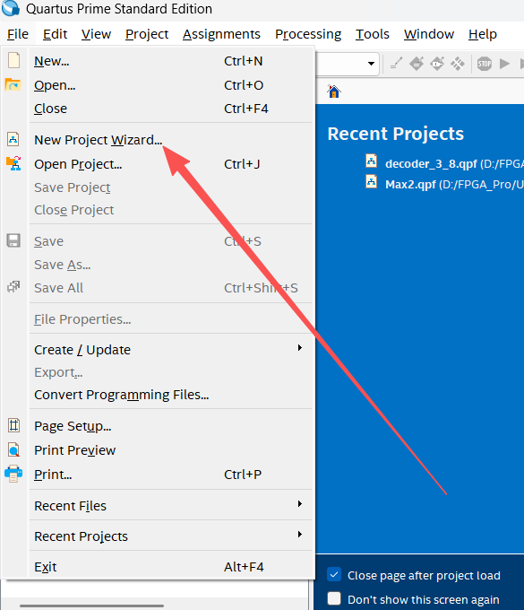
这里名字建议和项目名称一致  然后下一步
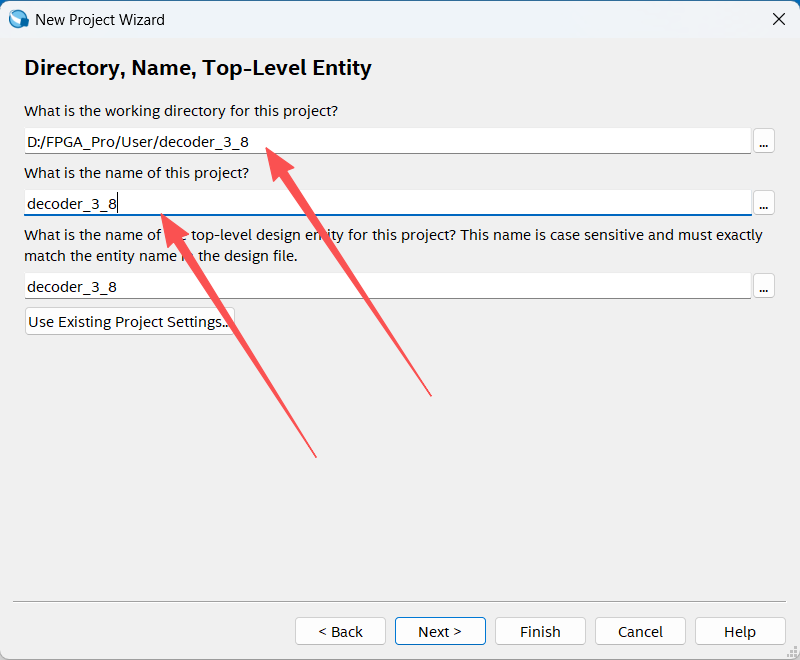
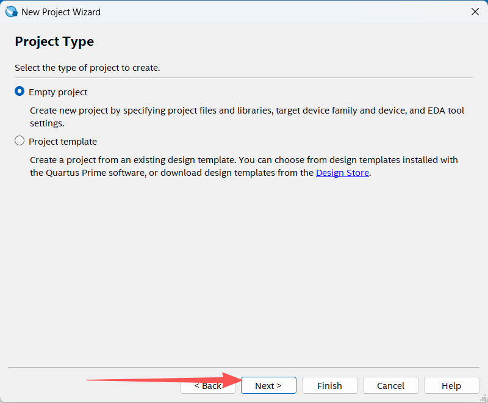
这里是添加已经写好的Verilog文件，这里我们没有，直接下一步
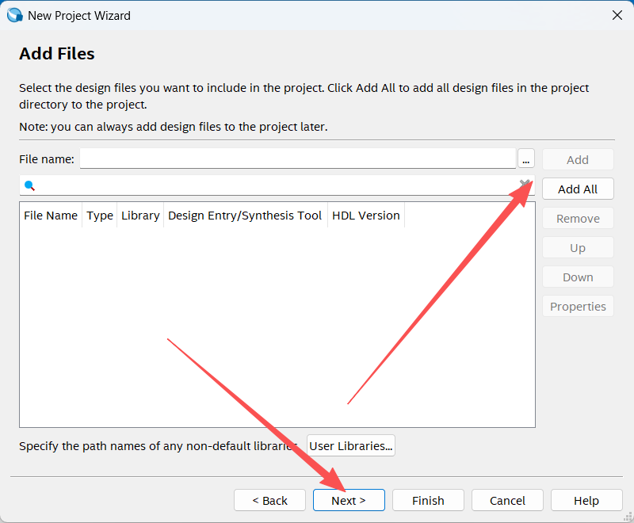
这里是选择芯片
我们使用的是小梅哥 AC620 开发板，所以选择如图，上面是筛选，下面是实际芯片，然后下一步
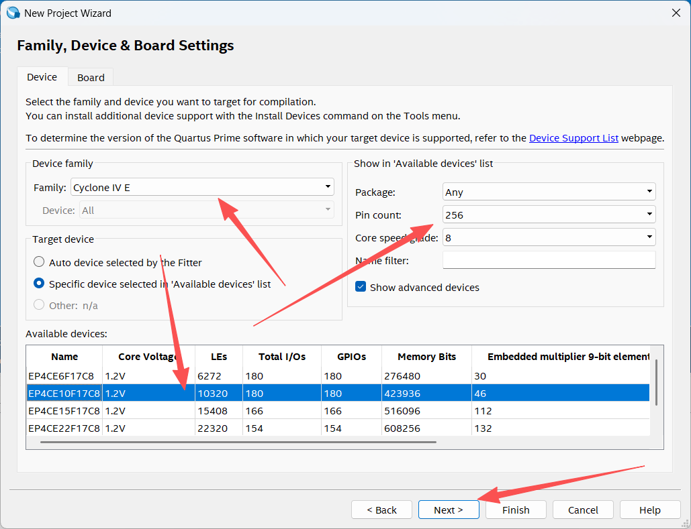
这里是选择仿真软件，我们选择如图软件，还有仿真语言，我们是verilog HDL ,然后下一步
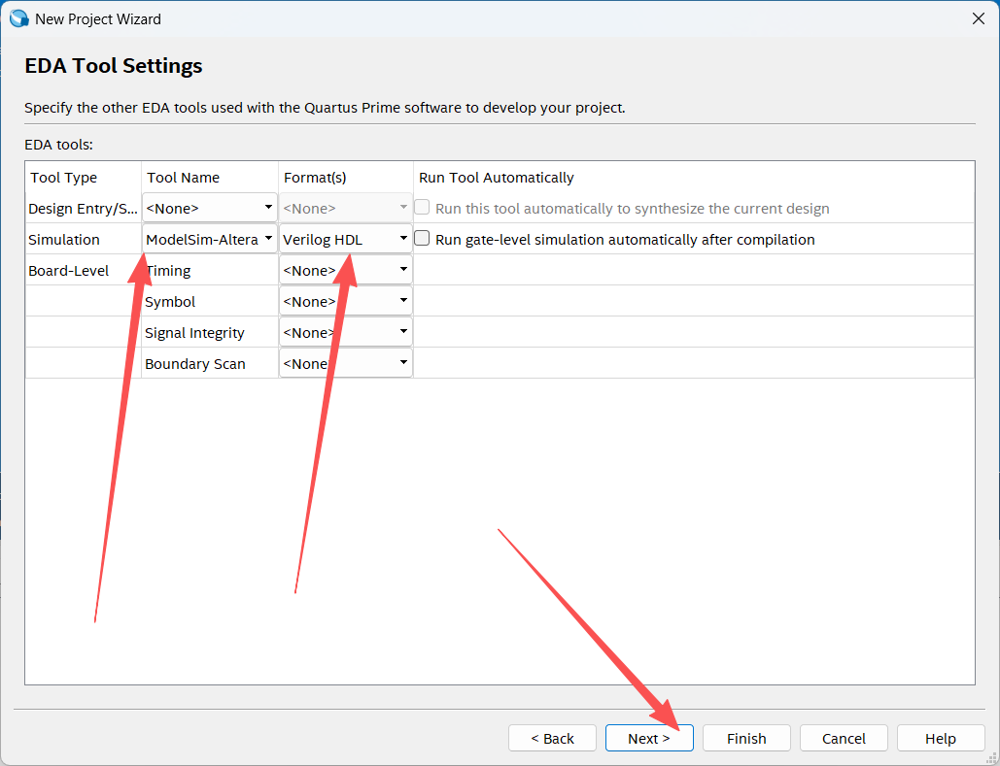
这里是新建的项目信息总览，就是我们前面选的参数等  然后是finish
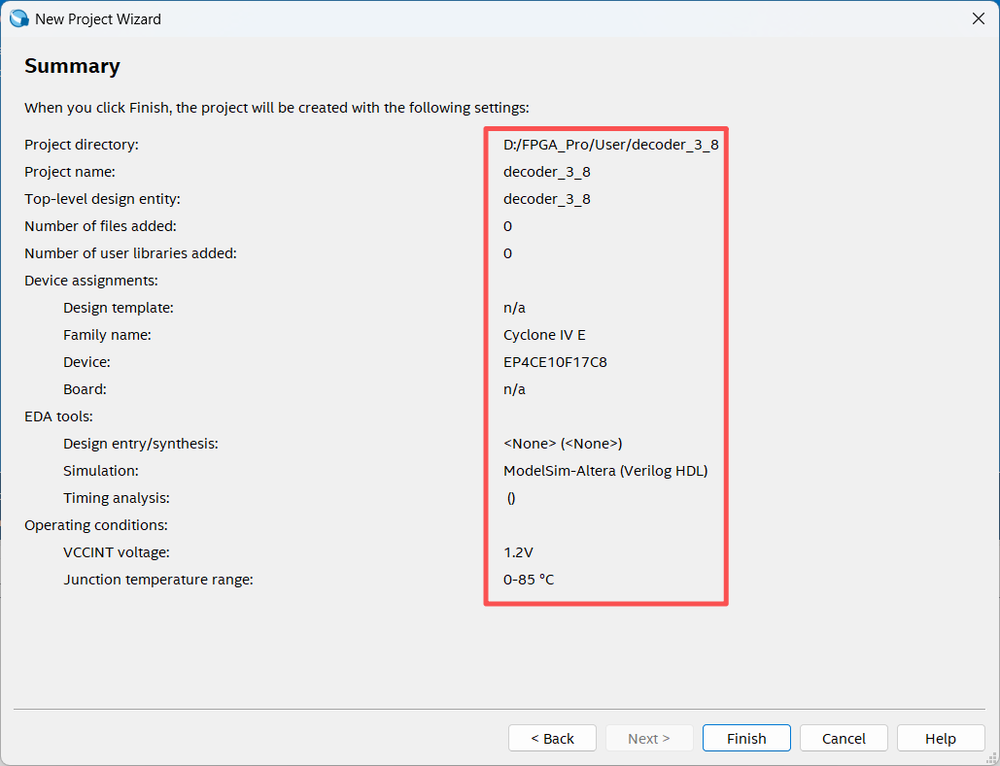

# 2、新建源文件
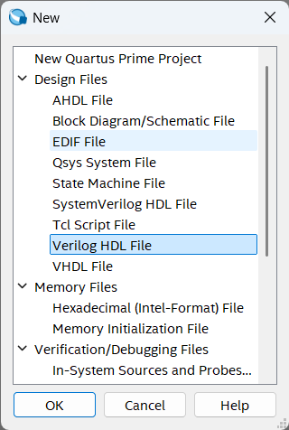
保存为，这里建议和项目文件一样
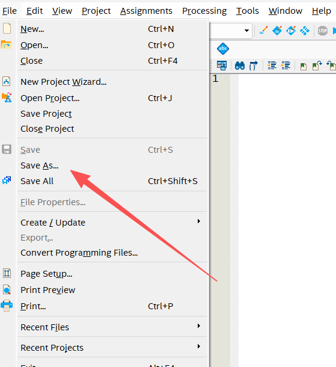
这里图中框选的文件是我们新建的，建议以后的项目都是这样。然后我们的源文件保存到src文件中
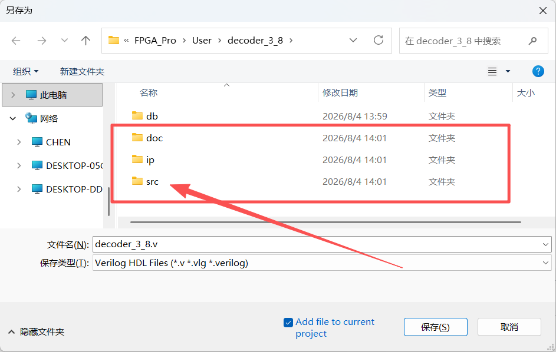
如图所示
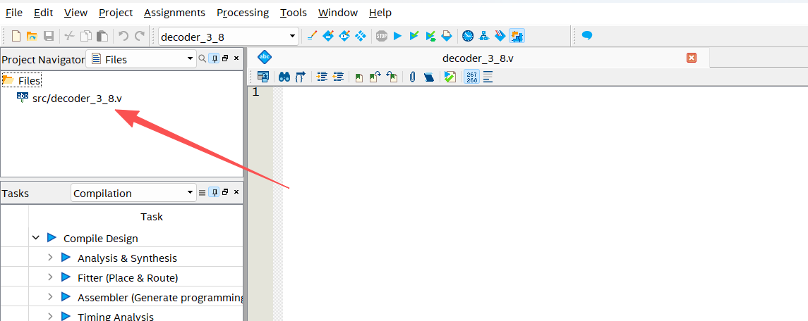

# 3、开始代码编写
这是38译码器的输入输出端口
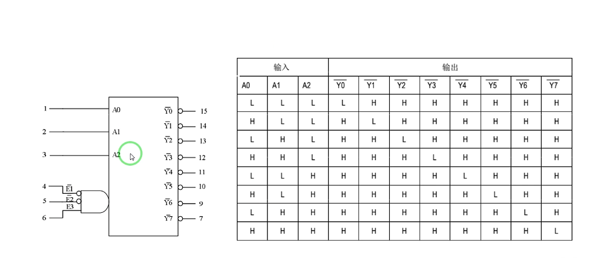

代码内容 （因为quartus软件的问题，不能使用中文注释）

module decoder_3_8(             //还是起手 module开始  endmodule结束  创建端口引子（有点类似
                                //C 的struct）

	A0,                         //3个输入端口
	A1,
	A2,
	Y0,                         //8个输出信号
	Y1,
	Y2,
	Y3,
	Y4,
	Y5,
	Y6,
	Y7			                //前面用，隔开，最后不能有，

);

	input A0;                   //定义引脚
	input A1;
	input A2;
	output reg Y0;              //既是输出又是寄存器信号  所以用output  reg
	output reg Y1;
	output reg Y2;
	output reg Y3;
	output reg Y4;
	output reg Y5;
	output reg Y6;
	output reg Y7;

	always@(*)                  //always  总是（一个循环）后面括号中的*是循环条件 *代表任何条件
                                //不知道是不是类似于C的  while(1)  ,还是 switch(),这个疑问以后
                                //验证呢
		case({A2,A1,A0})        //这是运行条件   3个输入口的输入可以组成8种不同的数据
                                //这里的'b,'o,'d,'h  分别表示fpga中的二进制，8进制，十进制，
                                //十六进制 ，各个进制间切换不影响数值本身的意义
                                //进制前面的3和8代表位宽，多少位bit 
			3'b000:	{Y7,Y6,Y5,Y4,Y3,Y2,Y1,Y0} = 8'b0000_0001;
			3'b001:	{Y7,Y6,Y5,Y4,Y3,Y2,Y1,Y0} = 8'b0000_0010;
			3'b010:	{Y7,Y6,Y5,Y4,Y3,Y2,Y1,Y0} = 8'b0000_0100;
			3'b011:	{Y7,Y6,Y5,Y4,Y3,Y2,Y1,Y0} = 8'b0000_1000;
			3'd4:	{Y7,Y6,Y5,Y4,Y3,Y2,Y1,Y0} = 8'b0001_0000;
			3'd5:	{Y7,Y6,Y5,Y4,Y3,Y2,Y1,Y0} = 8'b0010_0000;
			3'd6:	{Y7,Y6,Y5,Y4,Y3,Y2,Y1,Y0} = 8'b0100_0000;
			3'd7:	{Y7,Y6,Y5,Y4,Y3,Y2,Y1,Y0} = 8'b1000_0000;
			default: {Y7,Y6,Y5,Y4,Y3,Y2,Y1,Y0} = 8'b0000_0000;  //和C一样养成好习惯，
                                                                //default过滤其他条件
		endcase                                                 //这里有个结尾语句（C没有的）
	
endmodule  //文件项目结尾

# 开始做仿真代码